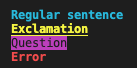

# Pretty Printer

### How to install:
    Clone the repostory and install dependecies with npm install

### How to use:
 After installed run the npm start command in the terminal and then typ the string you want to parse. Submit your sentences for parsing by pressing enter when you are done.  
 The sentences will then be separated and displayed by index and formatted by type of sentence.

 ### Errors
 The string that is to be parsed must contain at least one word and end with . ! or ? to count as a valid sentence. If Syntax Error is found a error will be thrown and you will be asked to type a new string.  
 If you don't want to type a new string after error press Ctrl + C

