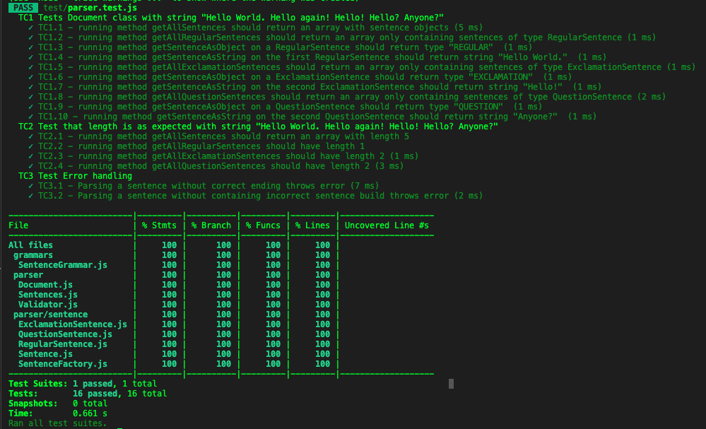
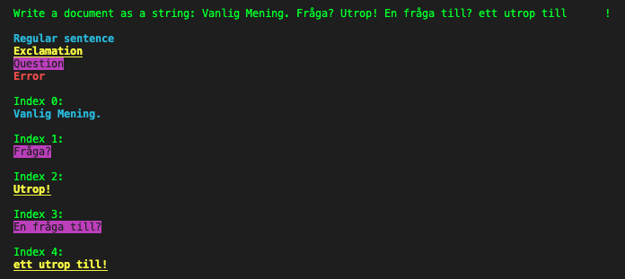
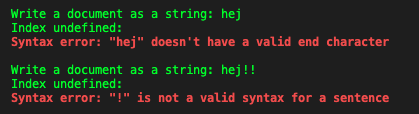

# Mall för inlämning laboration 1, 1dv610

## Checklista
  - [x] Jag har skrivit all kod och reflektioner själv. Jag har inte använt mig av andras kod för att lösa uppgiften.
  - [x] Mina testresultat är skrivna utifrån utförd testning ( och inte teoretiskt, "det bör fungera" :) )
  - [x] De enda statiska metoder eller funktioner utanför klasser som jag har är för att starta upp min testapplikation ex main(java).
  - [x] De enda bibliotek och färdiga klasser som används är sådana som måste användas (eller som används för att testa modulen).

## Egenskattning och mål
  - [ ] Jag är inte klar eftersom jag vet att jag saknar något. Då skall du inte lämna in!
  - [ ] Jag eftersträvar med denna inlämning godkänt betyg (E-D)
    - [ ] De flesta testfall fungerar (enstaka testfall kan misslyckas, tydligt vilka)
    - [ ] Koden är förberedd på återanvändning
    - [ ] All kod samt historik finns i git 
    - [ ] Reflektionerna är skrivna
    - [ ] Koden är läsbar
  - [x] Jag eftersträvar med denna inlämning högre betyg (C) och anser mig uppfylla alla extra krav för detta. 
    -[x] Jag är noga i min testning
    - [x] En del av testfallen är automatiserade (Tokenizer/Parser/PP), viss del kan vara manuellt testad.
    - [ ] Det finns en tydlig beskrivning i hur mina moduler skall användas. 
    - [ ] Mina reflektioner visar tydligt att jag förstått bokens koncept.
  - [ ] Jag eftersträvar med denna inlämning högsta betyg (A-B) 
    - [ ] Sammanhängande reflektion som ger ett gott helhetsintryck och visar detaljerad förståelse för kodkvalitet.
    - [ ] Min kod är ... (pussar fingrar och gör smackljud)
    - [ ] Extrauppgift parser finns med som egen modul(er)

Förtydligande: Examinator kommer sätta betyg oberoende på vad ni anser. Att ha "saker" från högre betygsnivåer verkar positivt och kan väga upp brister i inlämningen.

## Komponenter och återanvändning
 * Länka in URL om du använder olika repositorier för dina olika komponenter. 
    - [Tokenizer](https://gitlab.lnu.se/1dv610/student/du222aa/l1)
    - [Parser & PrettyPrinter](https://gitlab.lnu.se/1dv610/student/du222aa/l2)  

 * Beskriv komponenterna och hur de skall användas.
     - [Läs README.md](./README.md)
 * Beskriv hur du anpassat din kod och instruktioner för att någon annan programmerare skall kunna använda dina komponenter. Om du skrivit instruktioner för din användare länka till dessa. Om inte beskriv här hur någon skall göra.  
    - [Läs README.md](./README.md)
 * Beskriv hur du säkerhetställt att beroendena mellan komponenterna är som beskrivs i laborationen. 
    - Tokenizer är NPM paket och helt oberoende av koden i [Parser & PrettyPrinter](https://gitlab.lnu.se/1dv610/student/du222aa/l2)
    - Parsningen sker i parse metoden på Document klassen och denna testas av de Automatiska testerna helt utan att PrettyPrinter är inblandad.
    - Jag har skapat en fasad klass som kallas för ParserFacade och denna använder sig av PrettyPrinter som använder sig av Document.

## Beskrivning av min kod
Beskriv din kod på en hög abstraktionsnivå. En kort beskrivning av dina viktigaste klasser och metoder i dina komponenter. Skapa gärna ett klassdiagram som bild. Beskriv relationerna mellan klasserna mellan komponenter.

Det viktigaste för att parsningen ska fungera är Documentklassen eftersom denna innehåller parse metoden. Inne i parse metoden skapar jag en tokenizer vilket man skulle kunna skicka med som argument via konstruktorn i Document men eftersom jag skapat en Fasad-klass och därmed vill hålla så mkt av komplexiteten borta från användaren så har jag valt att inte ge möjligheten att skicka med Tokenizer via Dependecy Injection.  

## Hur jag testat
**Document** klassen med parsening och filtrering av olika typer av meningar är testat via automatiska tester. Se testrapport nedan:

### Testfall  
Tester kan köras via kommandot npm test.  

**PrettyPrinter** är testad manuellt: 

## Kapitelreflektioner för kapitel 2-11

### Kapitel 2 - Meaningful names

### Kapitel 3 - Functions

### Kapitel 4 - Comments

### Kapitel 5 - Formatting

### Kapitel 6 - Objects and Data Structures

### Kapitel 7 - Error Handling

### Kapitel 8 - Boundaries

### Kapitel 9 - Unit Tests

### Kapitel 10 - Classes

### Kapitel 11 - Systems

## Laborationsreflektion
Reflektera över uppgiften utifrån din utveckling som programmerare. 
Vad har du lärt dig och vad ser du fram emot att lära dig?
